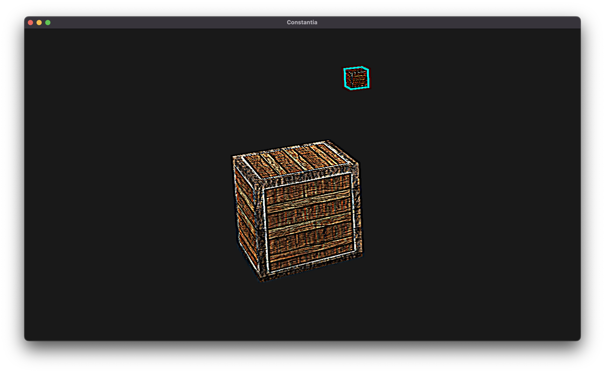
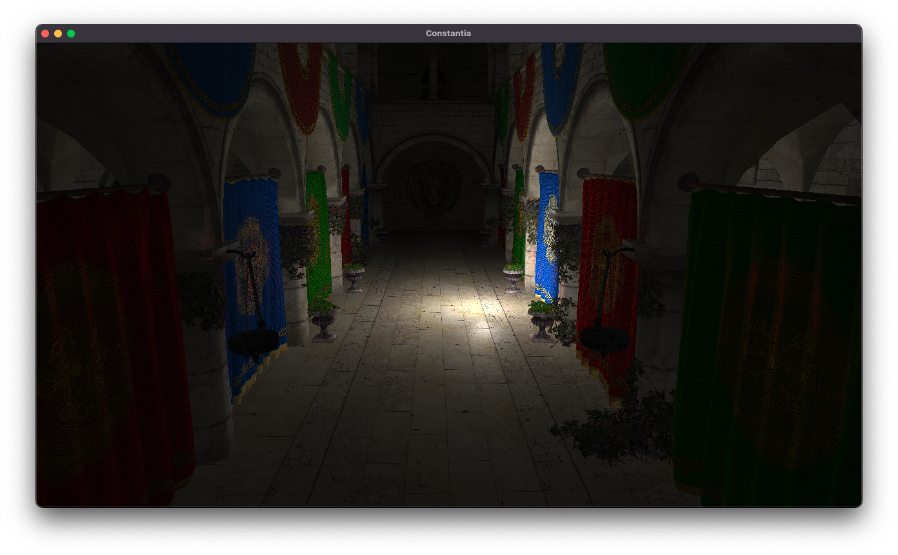

# Constantia

This project is my personal general 3D engine to learn graphics and game engine related stuff. This project is originated from my first project in 3D engine development named [Valiance](https://github.com/ricardonunosr/valiance) that was very much copied/inspired from [Hazel](https://github.com/TheCherno/Hazel) and i wanted to start fresh and relearn the basics.

Requeriments

- [CMake](https://cmake.org/)

Dependencies

- [glfw](https://github.com/glfw/glfw)
- [tinyobjloader](https://github.com/tinyobjloader/tinyobjloader)
- [glad2](https://github.com/Dav1dde/glad/tree/glad2)
- [glm](https://github.com/g-truc/glm)
- [imgui](https://github.com/ocornut/imgui)
- [spdlog](https://github.com/gabime/spdlog)
- [stb](https://github.com/nothings/stb)

# Screenshots



# Getting started

- Clone the repo

```bash
git clone --recursive https://github.com/ricardonunosr/constantia
```

- If you cloned non-recursively

```bash
git submodule update --init
```

- Change to the directory

```bash
cd constantia
```

- Use CMake to build repo ( using CMakePresets )

```bash
mkdir build
cmake --preset x64-Debug      #Change to x64-Debug-Mac for OSX build
cmake --build --preset x64-Debug
./build/x64-Debug/Debug/Constantia.exe
```
